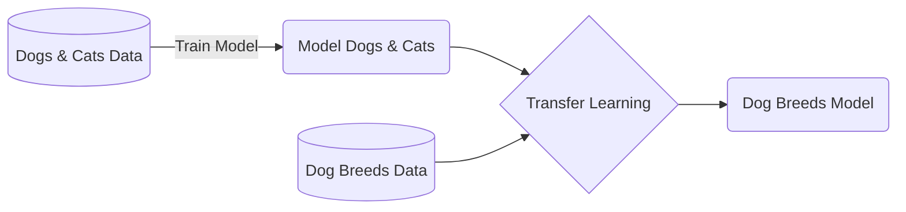
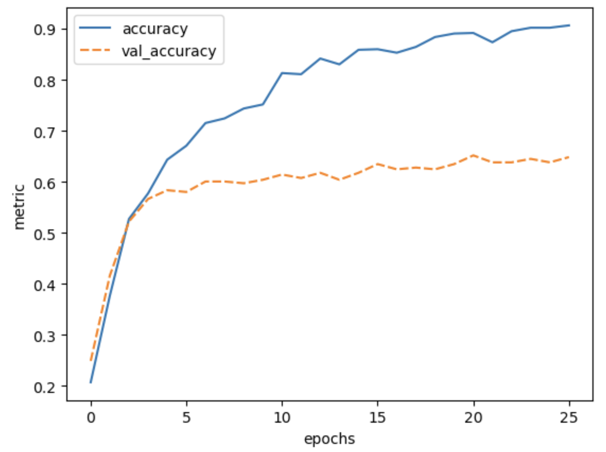
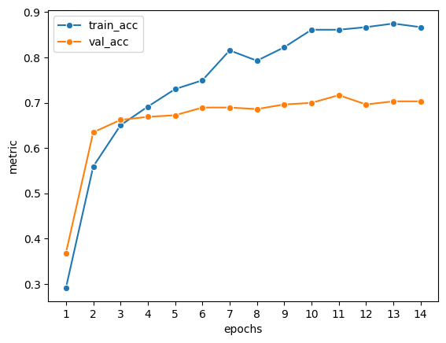

::: questions
- How do I apply a pre-trained model to my data?
:::

::: objectives
- Adapt a state-of-the-art pre-trained network to your own dataset
:::

## What is transfer learning?
Instead of training a model from scratch, with transfer learning you make use of models that are trained on another machine learning task. The pre-trained network captures generic knowledge during pre-training and will only be 'fine-tuned' to the specifics of your dataset.

An example: Let's say that you want to train a model to classify images of different dog breeds. You could make use of a pre-trained network that learned how to classify images of dogs and cats. The pre-trained network will not know anything about different dog breeds, but it will have captured some general knowledge of, on a high-level, what dogs look like, and on a low-level all the different features (eyes, ears, paws, fur) that make up an image of a dog. Further training this model on your dog breed dataset is a much easier task than training from scratch, because the model can use the general knowledge captured in the pre-trained network.



In this episode we will learn how to adapt a state-of-the-art pre-trained model to the [Dollar Street Dataset](https://zenodo.org/records/10970014).


## 1. Formulate / Outline the problem


Just like in the previous episode, we use the Dollar Street 10 dataset. 

We load the data in the same way as the previous episode:
```python
import pathlib
import numpy as np

DATA_FOLDER = pathlib.Path('data/dataset_dollarstreet/') # change to location where you stored the data
train_images = np.load(DATA_FOLDER / 'train_images.npy')
val_images = np.load(DATA_FOLDER / 'test_images.npy')
train_labels = np.load(DATA_FOLDER / 'train_labels.npy')
val_labels = np.load(DATA_FOLDER / 'test_labels.npy')
```
## 2. Identify inputs and outputs

As discussed in the previous episode, the input are images of dimension 64 x 64 pixels with 3 colour channels each.
The goal is to predict one out of 10 classes to which the image belongs.


## 3. Prepare the data

### Import the deep learning framework

::::::: group-tab

###### Keras

Before we move on to the next section of the workflow we need to make sure we have Keras imported.
We do this as follows:

```python
from tensorflow import keras
import tensorflow as tf

keras.utils.set_random_seed(2)

```

<!-- end-tab --><!-- end-tab -->

###### PyTorch

Before we move on to the next section of the workflow we need to make sure we have PyTorch imported.
We do this as follows:

```python
import torch
import torchvision

torch.manual_seed(2)
```

<!-- end-tab --><!-- end-tab -->
:::::::


::::::: group-tab

###### Keras
We prepare the data as before, scaling the values between 0 and 1.

```python
train_images = train_images / 255.0
val_images = val_images / 255.0
```

<!-- end-tab --><!-- end-tab -->

###### PyTorch

We introduce a dataset class here:
- Similar as in the previous session: It scales the values between 0 and 1, but also permutes the order of dimensions as image data is organised differently in PyTorch than in tensorflow.
- What is new is that, **we introduce an callable attribute `transform` to the dataset class**. This function preprocesses the images before feeding them to our neural network. It is a good practice to do this in the dataset class as then the transformations are only executed for an image when fetching the image. In our lesson here it would be also fine to do these once, but in many cases one would then run out of memory.

```python
class DollarStreetDataset(torch.utils.data.Dataset):
    def __init__(self, root, train=True, transform = None):
        prefix = "test"
        if train == True:
            prefix = "train"
        self.images = np.load(root / f'{prefix}_images.npy') / 255.
        self.labels = np.load(root / f'{prefix}_labels.npy')
        self.transform = transform
        
    def __getitem__(self, idx):
        # PyTorch requires another order of dimensions than the original tensorflow data
        x = torch.permute(torch.tensor(self.images[idx], dtype=torch.float), (2, 0, 1))
        
        # This is required as we would like to perform the transforms when fetching the data
        # Especially important, e.g., with large datasets or when doing augmentations
        if self.transform is not None:
            x = self.transform(x) 
        y = torch.tensor(self.labels[idx], dtype=torch.long)
        return x, y
        
    def __len__(self):
        return self.images.shape[0]
```


<!-- end-tab --><!-- end-tab -->
:::::::


## 4. Choose a pre-trained model or start building architecture from scratch

::: note
In practice, you would probably first pick a pre-trained model, and then realise what pre-processing needs to be done. The steps below can be seen as the results of an iterative work.
:::

Before loading any pre-trained model, we need to take care of the fact that our images have 64 x 64 pixels, whereas the pre-trained model that we will use was 
trained on images of 160 x 160 pixels. 

::::::: group-tab

###### Keras

Let's define our model input layer using the shape of our training images:
```python
# input tensor
inputs = keras.Input(train_images.shape[1:])
```

Our images are 64 x 64 pixels, whereas the pre-trained model that we will use was 
trained on images of 160 x 160 pixels.
To adapt our data accordingly, we add an upscale layer that resizes the images to 160 x 160 pixels during training and prediction.

```python
# upscale layer
method = tf.image.ResizeMethod.BILINEAR
upscale = keras.layers.Lambda(
  lambda x: tf.image.resize_with_pad(x, 160, 160, method=method))(inputs)
```
<!-- end-tab --><!-- end-tab -->

###### PyTorch

Our images are 64 x 64 pixels, whereas the pre-trained model that we will use was 
trained on images of 160 x 160 pixels.
To adapt our data accordingly, we define a `transform` function that resizes the images to 160 x 160 pixels during training and prediction.

```python
import torchvision.transforms as T

transform = T.Compose([
    T.ToPILImage(),
    T.Resize(160),        # keeps aspect ratio
    T.CenterCrop(160),    # ensures output is 160x160
    T.ToTensor()])
```

We pass our `transform` function when creating the `train_dataset` and `val_dataset`.

```
train_dataset = DollarStreetDataset(DATA_FOLDER, train=True, transform=transform)
val_dataset = DollarStreetDataset(DATA_FOLDER, train=False, transform=transform)
```

<!-- end-tab --><!-- end-tab -->
:::::::

We use a DenseNet121. This architecture was proposed by the paper: [Densely Connected Convolutional Networks (CVPR 2017)](https://arxiv.org/abs/1608.06993).
It is trained on the [Imagenet](https://www.image-net.org/) dataset, which contains 14,197,122 annotated images according to the WordNet hierarchy with over 20,000 classes.

We will have a look at the architecture later, for now it is enough to know
that it is a convolutional neural network with 121 layers that was designed 
to work well on image classification tasks.

::::::: group-tab

###### Keras
From the `keras.applications` module we use the `DenseNet121` architecture. 


Let's configure the DenseNet121:
```python
base_model = keras.applications.DenseNet121(include_top=False,
                                            pooling='max',
                                            weights='imagenet',
                                            input_tensor=upscale,
                                            input_shape=(160,160,3),
                                            )
```

::: callout
## SSL: certificate verify failed error
If you get the following error message: `certificate verify failed: unable to get local issuer certificate`,
you can download [the weights of the model manually](https://storage.googleapis.com/tensorflow/keras-applications/densenet/densenet121_weights_tf_dim_ordering_tf_kernels_notop.h5)
and then load in the weights from the downloaded file:

```python
base_model = keras.applications.DenseNet121(
    include_top=False,
    pooling='max',
    weights='densenet121_weights_tf_dim_ordering_tf_kernels_notop.h5', # this should refer to the weights file you downloaded
    input_tensor=upscale,
    input_shape=(160,160,3),
)
```
:::
By setting `include_top` to `False` we exclude the fully connected layer at the
top of the network, hence the final output layer. This layer was used to predict the Imagenet classes,
but will be of no use for our Dollar Street dataset.
Note that the 'top layer' appears at the bottom in the output of `model.summary()`.

We add `pooling='max'` so that max pooling is applied to the output of the DenseNet121 network.

By setting `weights='imagenet'` we use the weights that resulted from training
this network on the Imagenet data.

We connect the network to the `upscale` layer that we defined before.

<!-- end-tab --><!-- end-tab -->

###### PyTorch
From the `torchvision.models` module we use the `densenet121` architecture.


```python
import torch.nn as nn

# We would like to specify a sensible path for this as this is where the pre-trained model is stored.
os.environ['TORCH_HOME']='.'

class DenseNetClassifier(nn.Module):
    def __init__(self, num_classes):
        super().__init__()

        # taking the pre-trained model from torchvision here, but throwing away the head
        self.backbone = nn.Sequential(
                            torchvision.models.densenet121(weights="IMAGENET1K_V1").features,
                            nn.AdaptiveMaxPool2d((1, 1)),
                            nn.Flatten())
        
        # creating our own head for classification
        self.head = nn.Sequential(nn.BatchNorm1d(1024), 
                                        nn.Linear(1024, 50),
                                        nn.ReLU(),
                                        nn.Dropout(0.5),
                                        nn.Linear(50, num_classes))

    def forward(self, x):
        x = self.backbone(x)    # → [batch_dim, 1024]
        x = self.head(x)        # → [batch_dim, num_classes]
        return x
```

We would like to use only the feature extractor of the DenseNet and add our own classification head.
Thus, we use the `torchvision.models.densenet121(weights="IMAGENET1K_V1").features` subpart of the pre-trained DenseNet.
It maps each image to a vector of dimension `1024`. The `weights` parameter here specifies that we use ImageNet as pre-training data.
*Note that there are many different versions of ImageNet, but for this course it is fine that we use one version of ImageNet.*

The `self.head` maps from the vector of dimension `1024` to a vector of dimension `num_classes` (10 in our case).
The choices here are arbitrary, one might as well as head only one layer of `nn.Linear(1024, num_classes)`.


<!-- end-tab --><!-- end-tab -->
:::::::

### Only train a 'head' network
Instead of fine-tuning all the weights of the DenseNet121 network using our dataset,
we choose to freeze all these weights and only train a so-called 'head network' 
that sits on top of the pre-trained network. You can see the DenseNet121 network
as extracting a meaningful feature representation from our image. The head network
will then be trained to decide on which of the 10 Dollar Street dataset classes the image belongs.

::::::: group-tab

###### Keras


We will turn of the `trainable` property of the base model:
```python
base_model.trainable = False
```

Let's define our 'head' network:
```python
out = base_model.output
out = keras.layers.Flatten()(out)
out = keras.layers.BatchNormalization()(out)
out = keras.layers.Dense(50, activation='relu')(out)
out = keras.layers.Dropout(0.5)(out)
out = keras.layers.Dense(10)(out)
```

Finally we define our model:
```python
model = keras.models.Model(inputs=inputs, outputs=out)
```

<!-- end-tab --><!-- end-tab -->

###### PyTorch

In PyTorch, we can prevent updating layers of the model by setting the `param.requires_grad` property to `False`.
Here, we do that for the `backbone` part of the model as we would like to train the `head`.

```python
model = DenseNetClassifier(num_classes=10)

for param in model.backbone.parameters():
    param.requires_grad = False
```

If you want to make sure, you could print all parameters of `backbone` and `head` and see if they are frozen or not.

```python
print("Backbone parameters (should not be trainable)")
for name, param in list(model.backbone.named_parameters(prefix="backbone")):
    print(name, "trainable:", param.requires_grad)

print("\nBackbone parameters (should be trainable)")
for name, param in list(model.head.named_parameters(prefix="head")):
    print(name, "trainable:", param.requires_grad)

```

<!-- end-tab --><!-- end-tab -->
:::::::

:::::::::::: challenge
## Inspect the DenseNet121 network
Have a look at the network architecture:

::::::: group-tab

###### Keras

Use the following function:

```python
model.summary()
```

<!-- end-tab --><!-- end-tab -->

###### PyTorch
Use the following lines to generate the summary:

```python
from torchinfo import summary
summary(model, depth=2)
```
*(We set the `depth=2` to reduce the amount of lines printed.)*

<!-- end-tab --><!-- end-tab -->
:::::::

It is indeed a deep network, so expect a long summary!

### 1.Trainable parameters
How many parameters are there? How many of them are trainable? 

Why is this and how does it effect the time it takes to train the model?

### 2. Head and base
Can you see in the model summary which part is the base network and which part is the head network?

### 3. Max pooling (relevant only for Keras)
Which layer is added because we provided `pooling='max'` as argument for `DenseNet121()`?
::::::::::::

:::::::::::: solution
## Solutions
::::::: group-tab

###### Keras

### 1. Trainable parameters

Total number of parameters: 7,093,360, out of which only 53,808 are trainable.

The 53,808 trainable parameters are the weights of the head network. All other parameters are 'frozen' because we set `base_model.trainable=False`. Because only a small proportion of the parameters have to be updated at each training step, this will greatly speed up training time.

### 2. Head and base
The head network starts at the `flatten` layer, 5 layers before the final layer.

### 3. Max pooling (relevant only for Keras)
The `max_pool` layer right before the `flatten` layer is added because we provided `pooling='max'`.

<!-- end-tab --><!-- end-tab -->

###### PyTorch

### 1. Trainable parameters

Total number of parameters: 7,007,664, out of which only 53,808 are trainable.

The 53,808 trainable parameters are the weights of the head network. All other parameters are 'frozen' because we set `param.requires_grad = False`. Because only a small proportion of the parameters have to be updated at each training step, this will greatly speed up training time.

### 2. Head and base
The head network starts at the `flatten` layer, 5 layers before the final layer.


<!-- end-tab --><!-- end-tab -->
:::::::

::::::::::::


:::::::::::::::::::::::::::: challenge
## Training and evaluating the pre-trained model

Note that we have added more hints for PyTorch here as it requires more lines of code, but allows also for more customization.

::::::: group-tab

###### Keras
### 1. Compile the model
Compile the model:

- Use the `adam` optimizer 
- Use the `SparseCategoricalCrossentropy` loss with `from_logits=True`. 
- Use 'accuracy' as a metric.

### 2. Train the model
Train the model on the training dataset:

- Use a batch size of 32
- Train for 30 epochs, but use an earlystopper with a patience of 5
- Pass the validation dataset as validation data so we can monitor performance on the validation data during training
- Store the result of training in a variable called `history`
- Training can take a while, it is a much larger model than what we have seen so far.

### 3. Inspect the results
Plot the training history and evaluate the trained model. What do you think of the results?

### 4. (Optional) Try out other pre-trained neural networks
Train and evaluate another pre-trained model from [keras applications](https://keras.io/api/applications/). How does it compare to DenseNet121?

<!-- end-tab --><!-- end-tab -->

###### PyTorch

### 1. Define training and test loops

We first define two functions similar to session 4 that `train` and `test` the model.

```python
from tqdm import tqdm

def train(dataloader, model, loss_fn, optimizer, device):
    model.train()    
    train_loss = 0    
    correct = 0   
    total = 0

    # this tdqm magic is only there to make this progress bar appear    
    for step, (x, y) in (enumerate(pbar:=tqdm(dataloader))):
        x, y = x.to(device), y.to(device)
        optimizer.zero_grad()
        logits = model(x)
        loss = loss_fn(logits, y)
        loss.backward()
        optimizer.step()
        train_loss += loss.item() * x.size(0)
        preds = logits.argmax(dim=1)
        correct += (preds == y).sum().item()
        total += y.size(0) 
        pbar.set_description(f"Loss: {(loss.item()):>7f}")
        
    train_loss /= total
    train_acc = correct / total

    
    return train_loss, train_acc

def test(dataloder, model, loss_fn, device=torch.device("cuda:0")):
    model.eval()
    val_loss = 0
    correct = 0
    total = 0
    with torch.no_grad():
        for x, y in dataloder:
            x, y = x.to(device), y.to(device)
            logits = model(x)
            loss = loss_fn(logits, y)
            val_loss += loss.item() * x.size(0)
            preds = logits.argmax(dim=1)
            correct += (preds == y).sum().item()
            total += y.size(0)
        
        val_loss /= total
        val_acc = correct / total

    return val_loss, val_acc

```

### 2. Train the model

We use our `train` and `test` functions together with other objects know from prior sessions.

Note that in PyTorch early stopping needs to be defined by you as there is no predefined class as in Keras.

```python
from torch.utils.data import DataLoader
from torch.optim import Adam


# take a GPU as default when it is available
device = "cuda" if torch.cuda.is_available() else "cpu"


model = model.to(device)
optimizer = Adam(model.parameters(), lr=0.001) # learning rate is here set to the same as in Keras default
loss_fn = nn.CrossEntropyLoss()

train_loader = DataLoader(train_dataset, batch_size=32, shuffle=True)
val_loader = DataLoader(val_dataset, batch_size=32)

num_epochs = 30

# for early stopping
best_val_loss = float("inf")
patience = 5
wait = 0

# for bookkeeping
history = {"epoch": [], "train_loss": [],    "train_acc": [],    "val_loss": [],    "val_acc": []}

for epoch in range(num_epochs):
    train_loss, train_acc = train(dataloader=train_loader, model=model, loss_fn=loss_fn, optimizer=optimizer, device=device)
    val_loss, val_acc = test(dataloder=val_loader, model=model, loss_fn=loss_fn, device=device)
        
        
    # Save to history
    history["epoch"].append(str(epoch+1))
    history["train_loss"].append(train_loss)
    history["train_acc"].append(train_acc)
    history["val_loss"].append(val_loss)
    history["val_acc"].append(val_acc)


    # print progress
    print(f"Epoch {epoch+1}/{num_epochs} ",
    f"Train Loss: {train_loss:.4f} Train Acc: {train_acc:.4f} ",
    f"Val Loss: {val_loss:.4f} Val Acc: {val_acc:.4f}")

    # Early stopping (there is not a build-in version for that in PyTorch)
    if val_loss < best_val_loss:        
        best_val_loss = val_loss
        wait = 0
        torch.save(model.state_dict(), "best_model.pt")
    else:
        wait += 1
        if wait >= patience:
            print("Early stopping triggered.") 
            break

print(f"Training complete at epoch {epoch+1}")

```

### 3. Inspect the results

You can plot the results yourself or have a look at the plotting in the solution.

### 4. (Optional) Try out other pre-trained neural networks
Train and evaluate another pre-trained model from [torch vision](https://docs.pytorch.org/vision/main/models.html). How does it compare to DenseNet121?

<!-- end-tab --><!-- end-tab -->
:::::::

::::::::::::::::::::::::::::

:::::::::::::::::::::::::::: solution
## Solution

::::::: group-tab

###### Keras

### 1. Compile the model
```python
model.compile(optimizer='adam',
              loss=keras.losses.SparseCategoricalCrossentropy(from_logits=True),
              metrics=['accuracy'])
```

### 2. Train the model
Define the early stopper:
```python
early_stopper = keras.callbacks.EarlyStopping(monitor='val_accuracy',
                              patience=5)
```

Train the model:
```python
history = model.fit(x=train_images,
                    y=train_labels,
                    batch_size=32,
                    epochs=30,
                    callbacks=[early_stopper],
                    validation_data=(val_images, val_labels))
```

### 3. Inspect the results
```python
def plot_history(history, metrics):
    """
    Plot the training history

    Args:
        history (keras History object that is returned by model.fit())
        metrics(str, list): Metric or a list of metrics to plot
    """
    history_df = pd.DataFrame.from_dict(history.history)
    sns.lineplot(data=history_df[metrics])
    plt.xlabel("epochs")
    plt.ylabel("metric")

plot_history(history, ['accuracy', 'val_accuracy'])
```
{alt='Training history for training the pre-trained-model. The training accuracy slowly raises from 0.2 to 0.9 in 20 epochs. The validation accuracy starts higher at 0.25, but reaches a plateau around 0.64'}
The final validation accuracy reaches 64%, this is a huge improvement over 30% accuracy we reached with the simple convolutional neural network that we build from scratch in the previous episode.

<!-- end-tab --><!-- end-tab -->

###### PyTorch

### 1. See solution in exercise

### 2. See solution in exercise

### 3. Inspect the results

```python
def plot_history(history, metrics):
    history_df = pd.DataFrame.from_dict(history)
    for metric in metrics:
        sns.lineplot(data=history_df, x="epoch",y=metric, label=metric, marker="o")
    plt.xlabel("epochs")
    plt.ylabel("metric")

plot_history(history, ['train_acc', 'val_acc'])
```

{alt='Training history for training the pre-trained-model. The training accuracy slowly raises from 0.84 to 0.9 in 14 epochs. The validation accuracy starts higher, but reaches a plateau around 0.64'}
The final validation accuracy reaches 64%, this is a huge improvement over the accuracy we reached with the simple convolutional neural network that we build from scratch in the previous episode.


<!-- end-tab --><!-- end-tab -->
:::::::

::::::::::::::::::::::::::::

## Concluding: The power of transfer learning
In many domains, large networks are available that have been trained on vast amounts of data, such as in computer vision and natural language processing. Using transfer learning, you can benefit from the knowledge that was captured from another machine learning task. In many fields, transfer learning will outperform models trained from scratch, especially if your dataset is small or of poor quality.

Transfer learning adapts a model to a specific dataset. This typically leads to improvements in the particular domain covered by the data.
[Research](https://www.nature.com/articles/s41586-025-09937-5) has shown, however, that fine-tuning the model weights like this can have negative side effects on the model performance in other domains so that a specialized, fine-tuned model must be re-evaluated before using it for more generic tasks.

::: keypoints
- Large pre-trained models capture generic knowledge about a domain
- Use the `keras.applications` or `torchvision.models` module to easily use pre-trained models for your own datasets
- As usual with all options, there can be drawbacks to using pre-trained models.
:::
