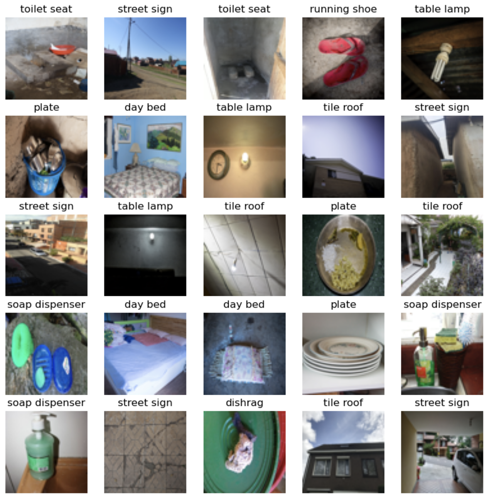
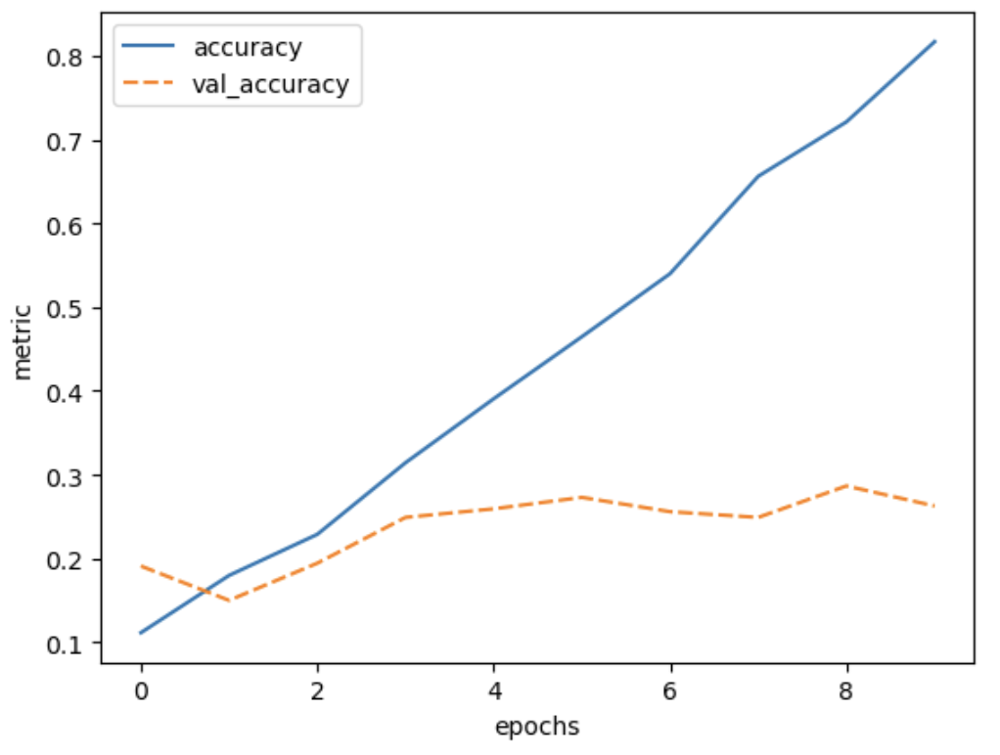
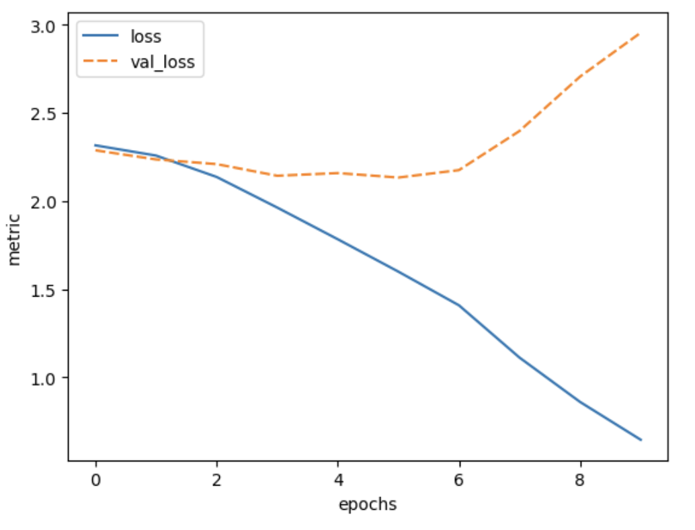
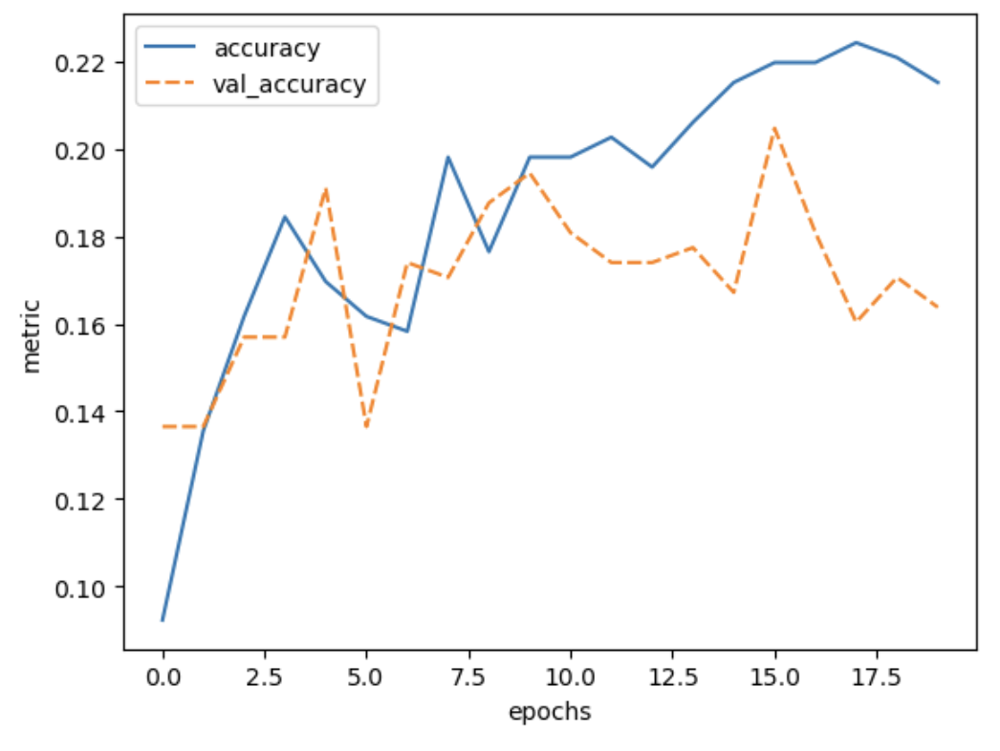
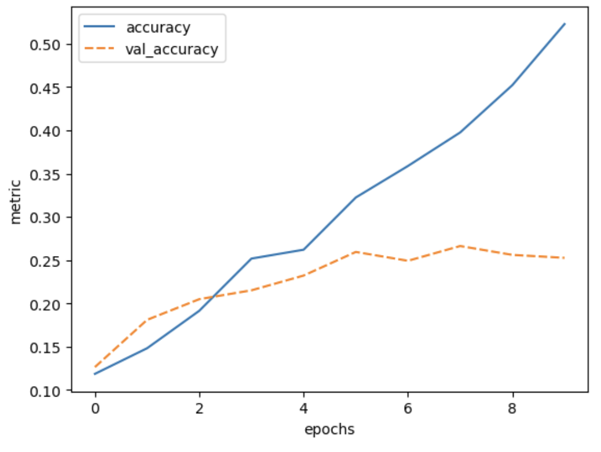
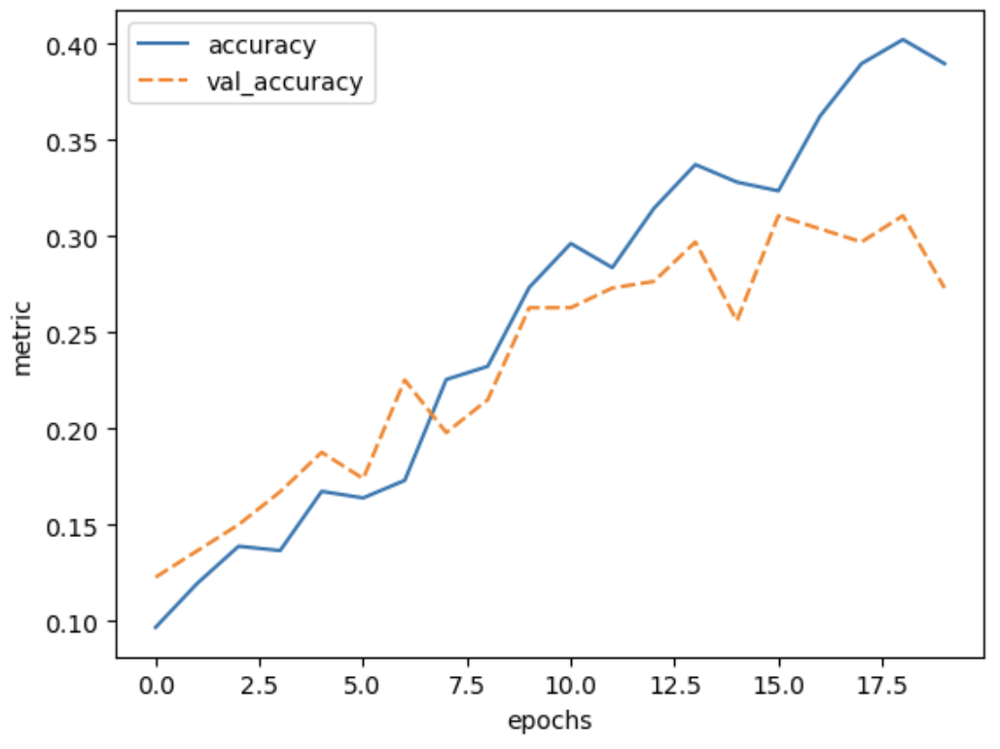
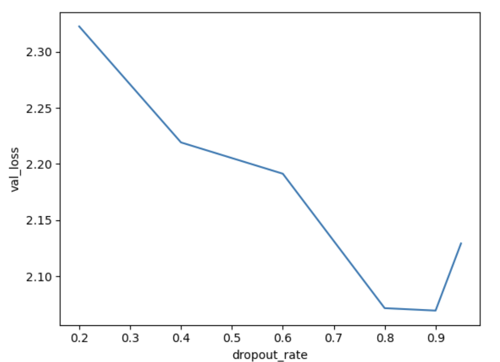

::: questions
- Why do we need different types of layers?
- What are good network designs for image data?
- What is a convolutional layer?
- How can we use different types of layers to prevent overfitting?
- What is hyperparameter tuning?
:::

::: objectives
- Understand why convolutional and pooling layers are useful for image data
- Implement a convolutional neural network on an image dataset
- Use a dropout layer to prevent overfitting
- Be able to tune the hyperparameters of a Keras model
:::


## Different types of layers
Networks are like onions: a typical neural network consists of many layers. In fact, the word *deep* in *deep learning*
refers to the many layers that make the network deep.

So far, we have seen one type of layer, namely the **fully connected**, or **dense** layer. This layer is called fully connected, because all input neurons are taken into account by each output neuron. The number of parameters that need to be learned by the network, is thus in the order of magnitude of the number of input neurons times the number of hidden neurons.

However, there are many different types of layers that perform different calculations and take different inputs. In this episode we will take a look at **convolutional layers** and **dropout layers**, which are useful in the context of image data, but also in many other types of (structured) data.

## 1. Formulate / Outline the problem: Image classification
The [MLCommons Dollar Street Dataset](https://www.kaggle.com/datasets/mlcommons/the-dollar-street-dataset) is a collection of images of everyday household items from homes around the world that visually captures socioeconomic diversity of traditionally underrepresented populations. We use [a subset of the original dataset](https://zenodo.org/records/10970014) that can be used for multiclass classification with 10 categories. Let's load the data:

```python
import pathlib
import numpy as np

DATA_FOLDER = pathlib.Path('data/dataset_dollarstreet/') # change to location where you stored the data
train_images = np.load(DATA_FOLDER / 'train_images.npy')
val_images = np.load(DATA_FOLDER / 'test_images.npy')
train_labels = np.load(DATA_FOLDER / 'train_labels.npy')
val_labels = np.load(DATA_FOLDER / 'test_labels.npy')
```

:::::::::::::::::::::::::::::::::::::::::: callout

### A note about data provenance
In an earlier version, this part of the lesson used a different example dataset.
During [peer review](https://github.com/carpentries-lab/reviews/issues/25#issuecomment-1953271802), the decision was made to replace that dataset due to the way it had been compiled using images "scraped" from the internet without permission from or credit to the original creators of those images. Unfortunately, uncredited use of images is a common problem among datasets used to benchmark models for image classification.

The Dollar Street dataset was chosen for use in the lesson as it contains only images [created by the Gapminder project](https://www.gapminder.org/dollar-street/about?) for the purposes of using them in the dataset.
The original Dollar Street dataset is very large -- more than 100 GB -- with the potential to grow even bigger, so we created a subset for use in this lesson.

::::::::::::::::::::::::::::::::::::::::::::::::::


### Dollar Street 10 dataset

The Dollar Street 10 dataset consists of images of 10 different classes, this is the mapping of the categories:

| Category        | label |
|-----------------|-------|
| day bed         | 0     |
| dishrag         | 1     |
| plate           | 2     |
| running shoe    | 3     |
| soap dispenser  | 4     |
| street sign     | 5     |
| table lamp      | 6     |
| tile roof       | 7     |
| toilet seat     | 8     |
| washing machine | 9     |

::::::::::::::::::::::::::::::::::::::::::::::::::::::::: instructor

### Framing the classification task
The sample images from the dataset, shown below, provide a good opportunity to lead a discussion with learners about the nature of the images and the classification task we will be training a model to perform.
For example, although the images can all be assumed to include the object they are labelled with, not all images are _of_ those objects i.e. the object is one of several present in the image.
This makes the task of the classifier more difficult, as does the more culturally diverse set of objects present in the image, but both of these properties make the trained model more robust.
After training, we can consider ourselves to be asking the model "which of these ten objects is present in this image?", as opposed to e.g. "which of these ten objects is this an image of?"

::::::::::::::::::::::::::::::::::::::::::::::::::::::::::::::::::::

{alt="A 5 by 5 grid of 25 sample images from the dollar street 10 data-set. Each image is labelled with a category, for example: 'street sign' or 'soap dispenser'."}

## 2. Identify inputs and outputs

### Explore the data

Let's do a quick exploration of the dimensions of the data:
```python
train_images.shape
```
```output
(878, 64, 64, 3)
```

The first value, `878`, is the number of training images in the dataset.
The remainder of the shape, namely `(64, 64, 3)`, denotes
the dimension of one image. The last value 3 is typical for color images,
and stands for the three color channels **R**ed, **G**reen, **B**lue.

:::: challenge

### Number of features in Dollar Street 10

How many features does one image in the Dollar Street 10 dataset have?

- A. 64
- B. 4096
- C. 12288
- D. 878


::: solution
The correct solution is C: 12288

There are 4096 pixels in one image (64 * 64), each pixel has 3 channels (RGB). So 4096 * 3 = 12288.
:::
::::


We can find out the range of values of our input data as follows:
```python
train_images.min(), train_images.max()
```
```output
(0, 255)
```
So the values of the three channels range between `0` and `255`.
Lastly, we inspect the dimension of the labels:
```python
train_labels.shape
```

```output
(878,)
```
So we have, for each image, a single value denoting the label.
To find out what the possible values of these labels are:
```python
train_labels.min(), train_labels.max()
```

```output
(0, 9)
```

The values of the labels range between `0` and `9`, denoting 10 different classes.

## 3. Prepare data

The training set consists of 878 images of `64x64` pixels and 3 channels (RGB values). The RGB values are between `0` and `255`. For input of neural networks, it is better to have small input values. So we normalize our data between `0` and `1`:


```python
train_images = train_images / 255.0
val_images = val_images / 255.0
```

## 4. Choose a pretrained model or start building architecture from scratch

### Convolutional layers
In the previous episodes, we used 'fully connected layers' , that connected all input values of a layer to all outputs of a layer.
This results in many connections, and thus many weights to be learned, in the network.
Note that our input dimension is now quite high (even with small pictures of `64x64` pixels): we have 12288 features.

:::: challenge
## Number of parameters{#parameters-exercise-1}
Suppose we create a single Dense (fully connected) layer with 100 hidden units that connect to the input pixels, how many parameters does this layer have?

- A. 1228800
- B. 1228900
- C. 100
- D. 12288

::: solution
## Solution
The correct answer is B: Each entry of the input dimensions, i.e. the `shape` of one single data point, is connected with 100 neurons of our hidden layer, and each of these neurons has a bias term associated to it. So we have `1228900` parameters to learn.
```python
width, height = (64, 64)
n_hidden_neurons = 100
n_bias = 100
n_input_items = width * height * 3
n_parameters = (n_input_items * n_hidden_neurons) + n_bias
n_parameters
```
```output
1228900
```
We can also check this by building the layer in Keras:
```python
inputs = keras.Input(shape=(n_input_items,))
outputs = keras.layers.Dense(100)(inputs)
model = keras.models.Model(inputs=inputs, outputs=outputs)
model.summary()
```
```output
Model: "functional"

┏━━━━━━━━━━━━━━━━━━━━━━━━━━━━━━┳━━━━━━━━━━━━━━━━━━━━━━┳━━━━━━━━━━━━━┓
┃ Layer (type)                 ┃ Output Shape         ┃     Param # ┃
┡━━━━━━━━━━━━━━━━━━━━━━━━━━━━━━╇━━━━━━━━━━━━━━━━━━━━━━╇━━━━━━━━━━━━━┩
│ input_layer (InputLayer)     │ (None, 12288)        │           0 │
├──────────────────────────────┼──────────────────────┼─────────────┤
│ dense (Dense)                │ (None, 100)          │   1,228,900 │
└──────────────────────────────┴──────────────────────┴─────────────┘

 Total params: 1,228,900 (4.69 MB)

 Trainable params: 1,228,900 (4.69 MB)

 Non-trainable params: 0 (0.00 B)
```
:::
::::

We can decrease the number of units in our hidden layer, but this also decreases the number of patterns our network can remember. Moreover, if we increase the image size, the number of weights will 'explode', even though the task of recognizing large images is not necessarily more difficult than the task of recognizing small images.

The solution is that we make the network learn in a 'smart' way. The features that we learn should be similar both for small and large images, and similar features (e.g. edges, corners) can appear anywhere in the image (in mathematical terms: *translation invariant*). We do this by making use of a concept from image processing that predates deep learning.

A **convolution matrix**, or **kernel**, is a matrix transformation that we 'slide' over the image to calculate features at each position of the image. For each pixel, we calculate the matrix product between the kernel and the pixel with its surroundings. A kernel is typically small, between 3x3 and 7x7 pixels. We can for example think of the 3x3 kernel:

```output
[[-1, -1, -1],
 [0, 0, 0]
 [1, 1, 1]]
```

This kernel will give a high value to a pixel if it is on a horizontal border between dark and light areas.
Note that for RGB images, the kernel should also have a depth of 3.

In the following image, we see the effect of such a kernel on the values of a single-channel image. The red cell in the output matrix is the result of multiplying and summing the values of the red square in the input, and the kernel. Applying this kernel to a real image shows that it indeed detects horizontal edges.

{alt='Example of a convolution matrix calculation' style='width:90%'}

{alt='Convolution example on an image of a cat to extract features' style='width:100%'}

In our **convolutional layer** our hidden units are a number of convolutional matrices (or kernels), where the values of the matrices are the weights that we learn in the training process. The output of a convolutional layer is an 'image' for each of the kernels, that gives the output of the kernel applied to each pixel.

::: callout
## Playing with convolutions
Convolutions applied to images can be hard to grasp at first. Fortunately there are resources out
there that enable users to interactively play around with images and convolutions:

- [Image kernels explained](https://setosa.io/ev/image-kernels/) shows how different convolutions can achieve certain effects on an image, like sharpening and blurring.
- [The convolutional neural network cheat sheet](https://stanford.edu/~shervine/teaching/cs-230/cheatsheet-convolutional-neural-networks#)
     shows animated examples of the different components of convolutional neural nets 
:::

:::: challenge
## Border pixels
What, do you think, happens to the border pixels when applying a convolution?

::: solution
## Solution
There are different ways of dealing with border pixels.
You can ignore them, which means that your output image is slightly smaller then your input.
It is also possible to 'pad' the borders, e.g. with the same value or with zeros, so that the convolution can also be applied to the border pixels.
In that case, the output image will have the same size as the input image.

[This callout in the Data Carpentry: Image Processing with Python curriculum](https://datacarpentry.org/image-processing/06-blurring.html#callout4)
provides more detail about convolution at the boundaries of an image,
in the context of applying a _Gaussian blur_.
:::
::::

:::: challenge
## Number of model parameters
Suppose we apply a convolutional layer with 100 kernels of size 3 * 3 * 3 (the last dimension applies to the rgb channels) to our images of 64 * 64 * 3 pixels. How many parameters do we have? Assume, for simplicity, that the kernels do not use bias terms. Compare this to the answer of the earlier exercise, ["Number of Parameters"](#parameters-exercise-1).

::: solution
## Solution
We have 100 matrices with 3 * 3 * 3 = 27 values each so that gives 27 * 100 = 2700 weights. This is a magnitude of 2000 less than the fully connected layer with 100 units! Nevertheless, as we will see, convolutional networks work very well for image data. This illustrates the expressiveness of convolutional layers.
:::
::::

So let us look at a network with a few convolutional layers. We need to finish with a Dense layer to connect the output cells of the convolutional layer to the outputs for our classes.

```python
from tensorflow import keras
keras.utils.set_random_seed(2)

inputs = keras.Input(shape=train_images.shape[1:])
x = keras.layers.Conv2D(50, (3, 3), activation='relu')(inputs)
x = keras.layers.Conv2D(50, (3, 3), activation='relu')(x)
x = keras.layers.Flatten()(x)
outputs = keras.layers.Dense(10)(x)

model = keras.Model(inputs=inputs, outputs=outputs, name="dollar_street_model_small")

model.summary()
```

```output
Model: "dollar_street_model_small"

┏━━━━━━━━━━━━━━━━━━━━━━━━━━━━━━┳━━━━━━━━━━━━━━━━━━━━━━┳━━━━━━━━━━━━━┓
┃ Layer (type)                 ┃ Output Shape         ┃     Param # ┃
┡━━━━━━━━━━━━━━━━━━━━━━━━━━━━━━╇━━━━━━━━━━━━━━━━━━━━━━╇━━━━━━━━━━━━━┩
│ input_layer_1 (InputLayer)   │ (None, 64, 64, 3)    │           0 │
├──────────────────────────────┼──────────────────────┼─────────────┤
│ conv2d (Conv2D)              │ (None, 62, 62, 50)   │       1,400 │
├──────────────────────────────┼──────────────────────┼─────────────┤
│ conv2d_1 (Conv2D)            │ (None, 60, 60, 50)   │      22,550 │
├──────────────────────────────┼──────────────────────┼─────────────┤
│ flatten (Flatten)            │ (None, 180000)       │           0 │
├──────────────────────────────┼──────────────────────┼─────────────┤
│ dense_1 (Dense)              │ (None, 10)           │   1,800,010 │
└──────────────────────────────┴──────────────────────┴─────────────┘

 Total params: 1,823,960 (6.96 MB)

 Trainable params: 1,823,960 (6.96 MB)

 Non-trainable params: 0 (0.00 B)
```

:::: challenge
## Convolutional Neural Network

Inspect the network above:

* What do you think is the function of the `Flatten` layer?
* Which layer has the most parameters? Do you find this intuitive?
* (optional) This dataset is similar to the often used CIFAR-10 dataset.
We can get inspiration for neural network architectures that could work on our dataset here: https://paperswithcode.com/sota/image-classification-on-cifar-10 . Pick a model and try to understand how it works.

::: solution
## Solution
* The Flatten layer converts the 60x60x50 output of the convolutional layer into a single one-dimensional vector, that can be used as input for a dense layer.
* The last dense layer has the most parameters. This layer connects every single output 'pixel' from the convolutional layer to the 10 output classes.
That results in a large number of connections, so a large number of parameters. This undermines a bit the expressiveness of the convolutional layers, that have much fewer parameters.
:::
::::

::: callout
## Search for existing architectures or pretrained models
So far in this course we have built neural networks from scratch, because we want you to fully understand the basics of Keras.
In the real world however, you would first search for existing solutions to your problem.

You could for example search for 'large CNN image classification Keras implementation', and see if you can find any Keras implementations
of more advanced architectures that you could reuse.
A lot of the best-performing architectures for image classification are convolutional neural networks or at least have some elements in common.
Therefore, we will introduce convolutional neural networks here, and the best way to teach you is by
developing a neural network from scratch!
:::

::: instructor
## Demonstrate searching for existing architectures
At this point it can be nice to apply above callout box and demonstrate searching for state-of-the-art implementations.
If you google for 'large CNN image classification Keras implementation' one of the top search results links to [an example from the Keras documentation for a small version of the Xception model](https://keras.io/examples/vision/image_classification_from_scratch/).

It can be a nice learning opportunity to go through the notebook and show that the learners should
already be familiar with a lot of the syntax (for example Conv2D, Dense, BatchNorm layers, adam optimizer, the deep learning workflow).
You can show that even though the model is much deeper, the input and output layer are still the same.
The aim is to demonstrate that what we are learning is really the basis for more complex models,
and you do not need to reinvent the wheel.
:::

### Pooling layers
Often in convolutional neural networks, the convolutional layers are intertwined with **Pooling layers**. As opposed to the convolutional layer, the pooling layer actually alters the dimensions of the image and reduces it by a scaling factor. It is basically decreasing the resolution of your picture. The rationale behind this is that higher layers of the network should focus on higher-level features of the image. By introducing a pooling layer, the subsequent convolutional layer has a broader 'view' on the original image.

Let's put it into practice. We compose a Convolutional network with two convolutional layers and two pooling layers.


```python
def create_nn(input_shape):
    inputs = keras.Input(shape=input_shape)
    x = keras.layers.Conv2D(50, (3, 3), activation='relu')(inputs)
    x = keras.layers.MaxPooling2D((2, 2))(x) # a new maxpooling layer
    x = keras.layers.Conv2D(50, (3, 3), activation='relu')(x)
    x = keras.layers.MaxPooling2D((2, 2))(x) # a new maxpooling layer (same as maxpool)
    x = keras.layers.Flatten()(x)
    x = keras.layers.Dense(50, activation='relu')(x) # a new Dense layer
    outputs = keras.layers.Dense(10)(x)

    model = keras.Model(inputs=inputs, outputs=outputs, name="dollar_street_model")
    return model

model = create_nn(input_shape=train_images.shape[1:])
model.summary()
```
```output
Model: "dollar_street_model"

┏━━━━━━━━━━━━━━━━━━━━━━━━━━━━━━┳━━━━━━━━━━━━━━━━━━━━━━┳━━━━━━━━━━━━━┓
┃ Layer (type)                 ┃ Output Shape         ┃     Param # ┃
┡━━━━━━━━━━━━━━━━━━━━━━━━━━━━━━╇━━━━━━━━━━━━━━━━━━━━━━╇━━━━━━━━━━━━━┩
│ input_layer_2 (InputLayer)   │ (None, 64, 64, 3)    │           0 │
├──────────────────────────────┼──────────────────────┼─────────────┤
│ conv2d_2 (Conv2D)            │ (None, 62, 62, 50)   │       1,400 │
├──────────────────────────────┼──────────────────────┼─────────────┤
│ max_pooling2d (MaxPooling2D) │ (None, 31, 31, 50)   │           0 │
├──────────────────────────────┼──────────────────────┼─────────────┤
│ conv2d_3 (Conv2D)            │ (None, 29, 29, 50)   │      22,550 │
├──────────────────────────────┼──────────────────────┼─────────────┤
│ max_pooling2d_1              │ (None, 14, 14, 50)   │           0 │
│ (MaxPooling2D)               │                      │             │
├──────────────────────────────┼──────────────────────┼─────────────┤
│ flatten_1 (Flatten)          │ (None, 9800)         │           0 │
├──────────────────────────────┼──────────────────────┼─────────────┤
│ dense_2 (Dense)              │ (None, 50)           │     490,050 │
├──────────────────────────────┼──────────────────────┼─────────────┤
│ dense_3 (Dense)              │ (None, 10)           │         510 │
└──────────────────────────────┴──────────────────────┴─────────────┘

 Total params: 514,510 (1.96 MB)

 Trainable params: 514,510 (1.96 MB)

 Non-trainable params: 0 (0.00 B)
```

## 5. Choose a loss function and optimizer

We compile the model using the adam optimizer (other optimizers could also be used here!).
Similar to the penguin classification task, we will use the crossentropy function to calculate the model's loss.
This loss function is appropriate to use when the data has two or more label classes.

Remember that our target class is represented by a single integer, whereas the output of our network has 10 nodes, one for each class.
So, we should have actually one-hot encoded the targets and used a softmax activation for the neurons in our output layer!
Luckily, there is a quick fix to calculate crossentropy loss for data that
has its classes represented by integers, the `SparseCategoricalCrossentropy()` function. 
Adding the argument `from_logits=True` accounts for the fact that the output has a linear activation instead of softmax.
This is what is often done in practice, because it spares you from having to worry about one-hot encoding.


```python
def compile_model(model):
    model.compile(optimizer='adam',
                  loss=keras.losses.SparseCategoricalCrossentropy(from_logits=True),
                  metrics=['accuracy'])
compile_model(model)
```

:::callout

## Choosing a Metric

As there are various loss functions, there are many metrics beyond the ones mentioned so far (root squared mean error and accuracy).
The documentation provides a comprehensive list of [metrics available in Keras](https://keras.io/api/metrics/), suitable for different tasks and datasets.

The purpose of an evaluation metric is to give a good reflection of how well a model performs on "real" data, hence new samples it has never encountered before.
Therefore, achieving a suspiciously high score can indicate that the chosen metric can be "cheated" by the model and is hence not suitable to measure the model performance.

For instance, you could use a dataset of 100 cat images and dog images for evaluating a model.
If the dataset is highly imbalanced so that 90 of these images are dogs, the model will achieve 90% accuracy by classifying each image as a dog.
But the number is misleading because the model might not have learned any characteristics of the images and never identify a cat image.
In such an imbalanced dataset, other metrics such as [precision](https://keras.io/api/metrics/classification_metrics/#precision-class) and [recall](https://keras.io/api/metrics/classification_metrics/#recall-class) are more suitable.

:::

::: instructor
## BREAK
This is a good time for switching instructor and/or a break.
:::

## 6. Train the model

We then train the model for 10 epochs:

```python
history = model.fit(train_images, train_labels, epochs=10,
                    validation_data=(val_images, val_labels))
```

## 7. Perform a Prediction/Classification
Here we skip performing a prediction, and continue to measuring the performance.
In practice, you will only do this step once in a while when you actually need to have the individual predictions,
often you know enough based on the evaluation metric scores.
Of course, behind the scenes whenever you measure performance you have to make predictions and compare them to the ground truth.

## 8. Measure performance

We can plot the training process using the history:

```python
import seaborn as sns
import matplotlib.pyplot as plt
import pandas as pd

def plot_history(history, metrics):
    """
    Plot the training history

    Args:
        history (keras History object that is returned by model.fit())
        metrics(str, list): Metric or a list of metrics to plot
    """
    history_df = pd.DataFrame.from_dict(history.history)
    sns.lineplot(data=history_df[metrics])
    plt.xlabel("epochs")
    plt.ylabel("metric")
plot_history(history, ['accuracy', 'val_accuracy'])
```
{alt='Plot of training accuracy and validation accuracy vs epochs for the trained model, showing training accuracy incrasing consistently by approximately 0.1 for each epoch while validation accuracy remains steady, with only slight fluctuations around 0.25.'}

```python
plot_history(history, ['loss', 'val_loss'])
```

{alt='Plot of training loss and validation loss vs epochs for the trained model, showing training loss steadily decreasing while validation loss remains steady before increasing after the sixth epoch.'}

It seems that the model is overfitting a lot, because the training accuracy increases, while the validation accuracy stagnates. Meanwhile, the training loss keeps decreasing while the validation loss actually starts increasing after a few epochs.

::: instructor
## Comparison with a network with only dense layers
The callout box below compares the CNN approach with a network with only dense layers.
Depending on time, the following discussion can be extended in depth up to your liking. You have several options:

1. It can be used as a good recap exercise. The exercise question is then:
'How does this simple CNN compare to a neural network with only dense layers?
Implement a dense neural network and compare its performance to that of the CNN'.
This will take 30-45 minutes and might deviate the focus away from CNNs.
2. You can demonstrate (no typing along), just to show how the network would look like and make the comparison.
3. You can just mention that a simple network with only dense layers reaches 18% accuracy, considerably worse than our simple CNN.
:::

::: callout
## Comparison with a network with only dense layers
How does this simple CNN compare to a neural network with only dense layers?

We can define a neural network with only dense layers:
```python
def create_dense_model():
    inputs = keras.Input(shape=train_images.shape[1:])
    x = keras.layers.Flatten()(inputs)
    x = keras.layers.Dense(50, activation='relu')(x)
    x = keras.layers.Dense(50, activation='relu')(x)
    outputs = keras.layers.Dense(10)(x)
    return keras.models.Model(inputs=inputs, outputs=outputs,
                              name='dense_model')

dense_model = create_dense_model()
dense_model.summary()
```
```output
Model: "dense_model"

┏━━━━━━━━━━━━━━━━━━━━━━━━━━━━━━┳━━━━━━━━━━━━━━━━━━━━━━┳━━━━━━━━━━━━━┓
┃ Layer (type)                 ┃ Output Shape         ┃     Param # ┃
┡━━━━━━━━━━━━━━━━━━━━━━━━━━━━━━╇━━━━━━━━━━━━━━━━━━━━━━╇━━━━━━━━━━━━━┩
│ input_layer_3 (InputLayer)   │ (None, 64, 64, 3)    │           0 │
├──────────────────────────────┼──────────────────────┼─────────────┤
│ flatten_2 (Flatten)          │ (None, 12288)        │           0 │
├──────────────────────────────┼──────────────────────┼─────────────┤
│ dense_4 (Dense)              │ (None, 50)           │     614,450 │
├──────────────────────────────┼──────────────────────┼─────────────┤
│ dense_5 (Dense)              │ (None, 50)           │       2,550 │
├──────────────────────────────┼──────────────────────┼─────────────┤
│ dense_6 (Dense)              │ (None, 10)           │         510 │
└──────────────────────────────┴──────────────────────┴─────────────┘

 Total params: 617,510 (2.36 MB)

 Trainable params: 617,510 (2.36 MB)

 Non-trainable params: 0 (0.00 B)
```
As you can see this model has more parameters than our simple CNN, let's train and evaluate it!

```python
compile_model(dense_model)
history = dense_model.fit(train_images, train_labels, epochs=20,
                    validation_data=(val_images, val_labels))
plot_history(history, ['accuracy', 'val_accuracy'])
```
{alt="Plot of training accuracy and validation accuracy vs epochs for a model with only dense layers, showing training accuracy increasing to approximately 0.22 and validation accuracy plateauing around 0.18. Both values show relatively large fluctations as training progresses."}

As you can see the validation accuracy only reaches about 18%, whereas the CNN reached about 28% accuracy.

This demonstrates that convolutional layers are a big improvement over dense layers for these kind of datasets.
:::

## 9. Refine the model

:::: challenge
## Network depth
What, do you think, will be the effect of adding a convolutional layer to your model? Will this model have more or fewer parameters?
Try it out. Create a `model` that has an additional `Conv2d` layer with 50 filters and another MaxPooling2D layer after the last MaxPooling2D layer. Train it for 10 epochs and plot the results.

**HINT**:
The model definition that we used previously needs to be adjusted as follows:
```python
inputs = keras.Input(shape=train_images.shape[1:])
x = keras.layers.Conv2D(50, (3, 3), activation='relu')(inputs)
x = keras.layers.MaxPooling2D((2, 2))(x)
x = keras.layers.Conv2D(50, (3, 3), activation='relu')(x)
x = keras.layers.MaxPooling2D((2, 2))(x)
# Add your extra layers here
x = keras.layers.Flatten()(x)
x = keras.layers.Dense(50, activation='relu')(x)
outputs = keras.layers.Dense(10)(x)
```

::: solution

## Solution
We add an extra Conv2D layer after the second pooling layer:
```python
def create_nn_extra_layer():
    inputs = keras.Input(shape=train_images.shape[1:])
    x = keras.layers.Conv2D(50, (3, 3), activation='relu')(inputs)
    x = keras.layers.MaxPooling2D((2, 2))(x)
    x = keras.layers.Conv2D(50, (3, 3), activation='relu')(x)
    x = keras.layers.MaxPooling2D((2, 2))(x) #
    x = keras.layers.Conv2D(50, (3, 3), activation='relu')(x) # extra layer
    x = keras.layers.MaxPooling2D((2, 2))(x) # extra layer
    x = keras.layers.Flatten()(x)
    x = keras.layers.Dense(50, activation='relu')(x)
    outputs = keras.layers.Dense(10)(x)

    model = keras.Model(inputs=inputs, outputs=outputs, name="dollar_street_model")
    return model

model = create_nn_extra_layer()
```

With the model defined above, we can inspect the number of parameters:
```python
model.summary()
```
```output
Model: "dollar_street_model"

┏━━━━━━━━━━━━━━━━━━━━━━━━━━━━━━┳━━━━━━━━━━━━━━━━━━━━━━┳━━━━━━━━━━━━━┓
┃ Layer (type)                 ┃ Output Shape         ┃     Param # ┃
┡━━━━━━━━━━━━━━━━━━━━━━━━━━━━━━╇━━━━━━━━━━━━━━━━━━━━━━╇━━━━━━━━━━━━━┩
│ input_layer_4 (InputLayer)   │ (None, 64, 64, 3)    │           0 │
├──────────────────────────────┼──────────────────────┼─────────────┤
│ conv2d_4 (Conv2D)            │ (None, 62, 62, 50)   │       1,400 │
├──────────────────────────────┼──────────────────────┼─────────────┤
│ max_pooling2d_2              │ (None, 31, 31, 50)   │           0 │
│ (MaxPooling2D)               │                      │             │
├──────────────────────────────┼──────────────────────┼─────────────┤
│ conv2d_5 (Conv2D)            │ (None, 29, 29, 50)   │      22,550 │
├──────────────────────────────┼──────────────────────┼─────────────┤
│ max_pooling2d_3              │ (None, 14, 14, 50)   │           0 │
│ (MaxPooling2D)               │                      │             │
├──────────────────────────────┼──────────────────────┼─────────────┤
│ conv2d_6 (Conv2D)            │ (None, 12, 12, 50)   │      22,550 │
├──────────────────────────────┼──────────────────────┼─────────────┤
│ max_pooling2d_4              │ (None, 6, 6, 50)     │           0 │
│ (MaxPooling2D)               │                      │             │
├──────────────────────────────┼──────────────────────┼─────────────┤
│ flatten_3 (Flatten)          │ (None, 1800)         │           0 │
├──────────────────────────────┼──────────────────────┼─────────────┤
│ dense_7 (Dense)              │ (None, 50)           │      90,050 │
├──────────────────────────────┼──────────────────────┼─────────────┤
│ dense_8 (Dense)              │ (None, 10)           │         510 │
└──────────────────────────────┴──────────────────────┴─────────────┘

 Total params: 137,060 (535.39 KB)

 Trainable params: 137,060 (535.39 KB)

 Non-trainable params: 0 (0.00 B)
```
The number of parameters has decreased by adding this layer.
We can see that the extra layers decrease the resolution from 14x14 to 6x6,
as a result, the input of the Dense layer is smaller than in the previous network.
To train the network and plot the results:
```python
compile_model(model)
history = model.fit(train_images, train_labels, epochs=10,
                   validation_data=(val_images, val_labels))
plot_history(history, ['accuracy', 'val_accuracy'])
```

{alt="Plot of training accuracy and validation accuracy vs epochs for the trained model, showing training accuracy increasing steadily by approximately 0.04 per epoch up to around 0.55 while validation accuracy increases before plateauing around 0.25."}

:::
::::

::: callout
## Other types of data
Convolutional and Pooling layers are also applicable to different types of
data than image data. Whenever the data is ordered in a (spatial) dimension,
and *translation invariant* features are expected to be useful, convolutions
can be used. Think for example of time series data from an accelerometer,
audio data for speech recognition, or 3d structures of chemical compounds.
:::

:::: challenge
## Why and when to use convolutional neural networks
1. Would it make sense to train a convolutional neural network (CNN) on the penguins dataset and why?
2. Would it make sense to train a CNN on the weather dataset and why?
3. (Optional) Can you think of a different machine learning task that would benefit from a
  CNN architecture?

::: solution
## Solution
1. No that would not make sense. Convolutions only work when the features of the data can be ordered 
  in a meaningful way. Pixels for example are ordered in a spatial dimension. 
  This kind of order cannot be applied to the features of the penguin dataset.
  If we would have pictures or audio recordings of the penguins as input data
  it would make sense to use a CNN architecture.
2. It would make sense, but only if we approach the problem from a different angle then we did before.
  Namely, 1D convolutions work quite well on sequential data such as timeseries. If we have as our input a matrix
  of the different weather conditions over time in the past x days, a CNN would be suited to quickly grasp
  the temporal relationship over days.
3. Some example domains in which CNNs are applied:
  - Text data
  - Timeseries, specifically audio
  - Molecular structures
:::
::::

### Dropout

Note that the training loss continues to decrease, while the validation loss stagnates, and even starts to increase over the course of the epochs. Similarly, the accuracy for the validation set does not improve anymore after some epochs. This means we are overfitting on our training data set.

Techniques to avoid overfitting, or to improve model generalization, are termed **regularization techniques**.
One of the most versatile regularization technique is **dropout** ([Srivastava et al., 2014](https://jmlr.org/papers/v15/srivastava14a.html)).
Dropout means that during each training cycle (one forward pass of the data through the model) a random fraction of neurons in a dense layer are turned off.
This is described with the dropout rate between 0 and 1 which determines the fraction of nodes to silence at a time.

{alt='A sketch of a neural network with and without dropout'}

The intuition behind dropout is that it enforces redundancies in the network by constantly removing different elements of a network. The model can no longer rely on individual nodes and instead must create multiple "paths". In addition, the model has to make predictions with much fewer nodes and weights (connections between the nodes).
As a result, it becomes much harder for a network to memorize particular features. At first this might appear a quite drastic approach which affects the network architecture strongly.
In practice, however, dropout is computationally a very elegant solution which does not affect training speed. And it frequently works very well.

**Important to note:** Dropout layers will only randomly silence nodes during training! During a prediction step, all nodes remain active (dropout is off). During training, the sample of nodes that are silenced are different for each training instance, to give all nodes a chance to observe enough training data to learn its weights.

Let us add a dropout layer after each pooling layer towards the end of the network that randomly drops 80% of the nodes.

```python
def create_nn_with_dropout():
    inputs = keras.Input(shape=train_images.shape[1:])
    x = keras.layers.Conv2D(50, (3, 3), activation='relu')(inputs)
    x = keras.layers.MaxPooling2D((2, 2))(x)
    x = keras.layers.Dropout(0.8)(x) # This is new!

    x = keras.layers.Conv2D(50, (3, 3), activation='relu')(x)
    x = keras.layers.MaxPooling2D((2, 2))(x)
    x = keras.layers.Dropout(0.8)(x) # This is new!

    x = keras.layers.Conv2D(50, (3, 3), activation='relu')(x)
    x = keras.layers.MaxPooling2D((2, 2))(x)
    x = keras.layers.Dropout(0.8)(x) # This is new!

    x = keras.layers.Flatten()(x)
    x = keras.layers.Dense(50, activation='relu')(x)
    outputs = keras.layers.Dense(10)(x)
    model = keras.Model(inputs=inputs, outputs=outputs, name="dropout_model")
    return model

model_dropout = create_nn_with_dropout()
model_dropout.summary()
```
```output
Model: "dropout_model"

┏━━━━━━━━━━━━━━━━━━━━━━━━━━━━━━┳━━━━━━━━━━━━━━━━━━━━━━┳━━━━━━━━━━━━━┓
┃ Layer (type)                 ┃ Output Shape         ┃     Param # ┃
┡━━━━━━━━━━━━━━━━━━━━━━━━━━━━━━╇━━━━━━━━━━━━━━━━━━━━━━╇━━━━━━━━━━━━━┩
│ input_layer_5 (InputLayer)   │ (None, 64, 64, 3)    │           0 │
├──────────────────────────────┼──────────────────────┼─────────────┤
│ conv2d_7 (Conv2D)            │ (None, 62, 62, 50)   │       1,400 │
├──────────────────────────────┼──────────────────────┼─────────────┤
│ max_pooling2d_5              │ (None, 31, 31, 50)   │           0 │
│ (MaxPooling2D)               │                      │             │
├──────────────────────────────┼──────────────────────┼─────────────┤
│ dropout (Dropout)            │ (None, 31, 31, 50)   │           0 │
├──────────────────────────────┼──────────────────────┼─────────────┤
│ conv2d_8 (Conv2D)            │ (None, 29, 29, 50)   │      22,550 │
├──────────────────────────────┼──────────────────────┼─────────────┤
│ max_pooling2d_6              │ (None, 14, 14, 50)   │           0 │
│ (MaxPooling2D)               │                      │             │
├──────────────────────────────┼──────────────────────┼─────────────┤
│ dropout_1 (Dropout)          │ (None, 14, 14, 50)   │           0 │
├──────────────────────────────┼──────────────────────┼─────────────┤
│ conv2d_9 (Conv2D)            │ (None, 12, 12, 50)   │      22,550 │
├──────────────────────────────┼──────────────────────┼─────────────┤
│ max_pooling2d_7              │ (None, 6, 6, 50)     │           0 │
│ (MaxPooling2D)               │                      │             │
├──────────────────────────────┼──────────────────────┼─────────────┤
│ dropout_2 (Dropout)          │ (None, 6, 6, 50)     │           0 │
├──────────────────────────────┼──────────────────────┼─────────────┤
│ flatten_4 (Flatten)          │ (None, 1800)         │           0 │
├──────────────────────────────┼──────────────────────┼─────────────┤
│ dense_9 (Dense)              │ (None, 50)           │      90,050 │
├──────────────────────────────┼──────────────────────┼─────────────┤
│ dense_10 (Dense)             │ (None, 10)           │         510 │
└──────────────────────────────┴──────────────────────┴─────────────┘

 Total params: 137,060 (535.39 KB)

 Trainable params: 137,060 (535.39 KB)

 Non-trainable params: 0 (0.00 B)
```

We can see that the dropout does not alter the dimensions of the image, and has zero parameters.

We again compile and train the model.
```python
compile_model(model_dropout)

history = model_dropout.fit(train_images, train_labels, epochs=20,
                    validation_data=(val_images, val_labels))
```

And inspect the training results:
```python
plot_history(history, ['accuracy', 'val_accuracy'])
```

{alt="Plot of training accuracy and validation accuracy vs epochs for the trained model, showing both values increasing before they diverge after around 10 epochs, with training accuracy reaching approximately 0.4 while validation accuracy plateaus around 0.3"}

Now we see that the gap between the training accuracy and validation accuracy is much smaller, and that the final accuracy on the validation set is higher than without dropout.

:::: challenge
## Vary dropout rate
1. What do you think would happen if you lower the dropout rate? Try it out, and
  see how it affects the model training.
2. You are varying the dropout rate and checking its effect on the model performance,
  what is the term associated to this procedure?

::: solution
## Solution
### 1. Varying the dropout rate
The code below instantiates and trains a model with varying dropout rates.
You can see from the resulting plot that the ideal dropout rate in this case is around 0.9.
This is where the val loss is lowest.

Note that it can take a while to train these 6 networks.

```python
def create_nn_with_dropout(dropout_rate):
    inputs = keras.Input(shape=train_images.shape[1:])
    x = keras.layers.Conv2D(50, (3, 3), activation='relu')(inputs)
    x = keras.layers.MaxPooling2D((2, 2))(x)
    x = keras.layers.Dropout(dropout_rate)(x)

    x = keras.layers.Conv2D(50, (3, 3), activation='relu')(x)
    x = keras.layers.MaxPooling2D((2, 2))(x)
    x = keras.layers.Dropout(dropout_rate)(x)

    x = keras.layers.Conv2D(50, (3, 3), activation='relu')(x)
    x = keras.layers.Dropout(dropout_rate)(x)
    x = keras.layers.Flatten()(x)
    x = keras.layers.Dense(50, activation='relu')(x)
    outputs = keras.layers.Dense(10)(x)
    model = keras.Model(inputs=inputs, outputs=outputs, name="dropout_model")
    return model

early_stopper = keras.callbacks.EarlyStopping(monitor='val_loss', patience=5)

dropout_rates = [0.2, 0.4, 0.6, 0.8, 0.9, 0.95]
val_losses = []
for dropout_rate in dropout_rates:
    model_dropout = create_nn_with_dropout(dropout_rate)
    compile_model(model_dropout)
    model_dropout.fit(train_images, train_labels, epochs=30,
                      validation_data=(val_images, val_labels),
                      callbacks=[early_stopper]
                      )

    val_loss, val_acc = model_dropout.evaluate(val_images,  val_labels)
    val_losses.append(val_loss)

loss_df = pd.DataFrame({'dropout_rate': dropout_rates, 'val_loss': val_losses})


sns.lineplot(data=loss_df, x='dropout_rate', y='val_loss')
```

{alt="Plot of vall loss vs dropout rate used in the model. The val loss varies between 2.3 and 2.0 and is lowest with a dropout_rate of 0.9"}


### 2. Term associated to this procedure
This is called hyperparameter tuning.
:::
::::

### Hyperparameter tuning
::: instructor
## Do a live demo instead of live coding
You might want to demonstrate this section on hyperparameter tuning instead of doing live coding.
The goal is to show that hyperparameter tuning can be done easily with `keras_tuner`, not to memorize all the exact syntax of how to do it. This will probably save you half an hour of participants typing over code that they already know from before. In addition, on really slow machines running the grid search could possibly take more than 10 minutes.
:::

Recall that hyperparameters are model configuration settings that are chosen before the training process and affect the model's learning behavior and performance, for example the dropout rate. In general, if you are varying hyperparameters to find the combination of hyperparameters with the best model performance this is called hyperparameter tuning. A naive way to do this is to write a for-loop and train a slightly different model in every cycle.
However, it is better to use the `keras_tuner` package for this.

Let's first define a function that creates a neuronal network given 2 hyperparameters, namely the dropout rate and the number of layers:
```python
def create_nn_with_hp(dropout_rate, n_layers):
    inputs = keras.Input(shape=train_images.shape[1:])
    x = inputs
    for layer in range(n_layers):
        x = keras.layers.Conv2D(50, (3, 3), activation='relu')(x)
        x = keras.layers.MaxPooling2D((2, 2))(x)
    x = keras.layers.Dropout(dropout_rate)(x)
    x = keras.layers.Flatten()(x)
    x = keras.layers.Dense(50, activation='relu')(x)
    outputs = keras.layers.Dense(10)(x)
    model = keras.Model(inputs=inputs, outputs=outputs, name="cifar_model")
    return model
```

Now, let's find the best combination of hyperparameters using grid search.
Grid search is the simplest hyperparameter tuning strategy,
you test all the combinations of predefined values for the hyperparameters that you want to vary.

For this we will make use of the package `keras_tuner`, we can install it by typing in the command line:
```bash
pip install keras_tuner
```

Note that this can take some time to train (around 5 minutes or longer).

```python
import keras_tuner

hp = keras_tuner.HyperParameters()

def build_model(hp):
    # Define values for hyperparameters to try out:
    n_layers = hp.Int("n_layers", min_value=1, max_value=2, step=1)
    dropout_rate = hp.Float("dropout_rate", min_value=0.2, max_value=0.8, step=0.3)

    model = create_nn_with_hp(dropout_rate, n_layers)
    compile_model(model)
    return model

tuner = keras_tuner.GridSearch(build_model, objective='val_loss')

tuner.search(train_images, train_labels, epochs=20,
             validation_data=(val_images, val_labels))
```
```output
Trial 6 Complete [00h 00m 19s]
val_loss: 2.086069345474243

Best val_loss So Far: 2.086069345474243
Total elapsed time: 00h 01m 28s
```
Let's have a look at the results:

```python
tuner.results_summary()
```
```output
Results summary
Results in ./untitled_project
Showing 10 best trials
Objective(name="val_loss", direction="min")

Trial 0005 summary
Hyperparameters:
n_layers: 2
dropout_rate: 0.8
Score: 2.086069345474243

Trial 0000 summary
Hyperparameters:
n_layers: 1
dropout_rate: 0.2
Score: 2.101102352142334

Trial 0001 summary
Hyperparameters:
n_layers: 1
dropout_rate: 0.5
Score: 2.1184325218200684

Trial 0003 summary
Hyperparameters:
n_layers: 2
dropout_rate: 0.2
Score: 2.1233835220336914

Trial 0002 summary
Hyperparameters:
n_layers: 1
dropout_rate: 0.8
Score: 2.1370232105255127

Trial 0004 summary
Hyperparameters:
n_layers: 2
dropout_rate: 0.5
Score: 2.143627882003784
```

:::: challenge

## Hyperparameter tuning

1: Looking at the grid search results, select all correct statements:

- A. 6 different models were trained in this grid search run, because there are 6 possible combinations for the defined hyperparameter values
- B. 2 different models were trained, 1 for each hyperparameter that we want to change
- C. 1 model is trained with 6 different hyperparameter combinations
- D. The model with 2 layer and a dropout rate of 0.5 is the best model with a validation loss of 2.144
- E. The model with 2 layers and a dropout rate of 0.8 is the best model with a validation loss of 2.086
- F. We found the model with the best possible combination of dropout rate and number of layers

2 (Optional): Perform a grid search finding the best combination of the following hyperparameters: 2 different activation functions: 'relu', and 'tanh', and 2 different values for the kernel size: 3 and 4. Which combination works best?

**Hint**: Instead of `hp.Int` you should now use `hp.Choice("name", ["value1", "value2"])` to use hyperparameters from a predefined set of possible values.

::: solution
## Solution

1:

- A: Correct, 2 values for number of layers (1 and 2) are combined with 3 values for the dropout rate (0.2, 0.5, 0.8). 2 * 3 = 6 combinations
- B: Incorrect, a model is trained for each combination of defined hyperparameter values
- C: Incorrect, it is important to note that you actually train and test different models for each run of the grid search
- D: Incorrect, this is the worst model since the validation loss is highest
- E: Correct, this is the best model with the lowest loss
- F: Incorrect, it could be that a different number of layers in combination with a dropout rate that we did not test (for example 3 layers and a dropout rate of 0.6) could be the best model.

2 (Optional):

You need to adapt the code as follows:
```python
def create_nn_with_hp(activation_function, kernel_size):
    inputs = keras.Input(shape=train_images.shape[1:])
    x = inputs
    for layer in range(3):
        x = keras.layers.Conv2D(50, (kernel_size, kernel_size), activation=activation_function)(x)
        x = keras.layers.MaxPooling2D((2, 2))(x)
    x = keras.layers.Dropout(0.2)(x)
    x = keras.layers.Flatten()(x)
    x = keras.layers.Dense(50, activation=activation_function)(x)
    outputs = keras.layers.Dense(10)(x)
    model = keras.Model(inputs=inputs, outputs=outputs, name="cifar_model")
    return model

hp = keras_tuner.HyperParameters()

def build_model(hp):
    kernel_size = hp.Int("kernel_size", min_value=3, max_value=4, step=1)
    activation = hp.Choice("activation", ["relu", "tanh"])
    model = create_nn_with_hp(activation, kernel_size)
    compile_model(model)
    return model

tuner = keras_tuner.GridSearch(build_model, objective='val_loss', project_name='new_project')
tuner.search(train_images, train_labels, epochs=20,
             validation_data=(val_images, val_labels))
```
```output
Trial 4 Complete [00h 00m 25s]
val_loss: 2.0591845512390137

Best val_loss So Far: 2.0277602672576904
Total elapsed time: 00h 01m 30s
```
Let's look at the results:
```python
tuner.results_summary()
```
```output
Results summary
Results in ./new_project
Showing 10 best trials
Objective(name="val_loss", direction="min")

Trial 0001 summary
Hyperparameters:
kernel_size: 3
activation: tanh
Score: 2.0277602672576904

Trial 0003 summary
Hyperparameters:
kernel_size: 4
activation: tanh
Score: 2.0591845512390137

Trial 0000 summary
Hyperparameters:
kernel_size: 3
activation: relu
Score: 2.123767614364624

Trial 0002 summary
Hyperparameters:
kernel_size: 4
activation: relu
Score: 2.150160551071167
```
A kernel size of 3 and `tanh` as activation function is the best tested combination.

:::
::::

Grid search can quickly result in a combinatorial explosion because all combinations of hyperparameters are trained and tested.
Instead, `random search` randomly samples combinations of hyperparemeters, allowing for a much larger look through a large number of possible hyperparameter combinations.

Next to grid search and random search there are many different hyperparameter tuning strategies, including [neural architecture search](https://en.wikipedia.org/wiki/Neural_architecture_search) where a separate neural network is trained to find the best architecture for a model!

## 10. Share model
Let's save our model

```python
model.save('cnn_model.keras')
```

## Conclusion and next steps
How successful were we with creating a model here?
With ten image classes, and assuming that we would not ask the model to classify an image that contains none of the given classes of object, a model working on complete guesswork would be correct 10% of the time.
Against this baseline accuracy of 10%, and considering the diversity and relatively low resolution of the example images, perhaps our last model's validation accuracy of ~30% is not too bad.
What could be done to improve on this performance?
We might try adjusting the number of layers and their parameters, such as the number of units in a layer, or providing more training data (we were using only a subset of the original Dollar Street dataset here).
Or we could explore some other deep learning techniques, such as transfer learning, to create more sophisticated models.

::: keypoints
- Convolutional layers make efficient reuse of model parameters.
- Pooling layers decrease the resolution of your input
- Dropout is a way to prevent overfitting
:::
